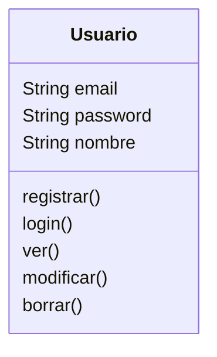
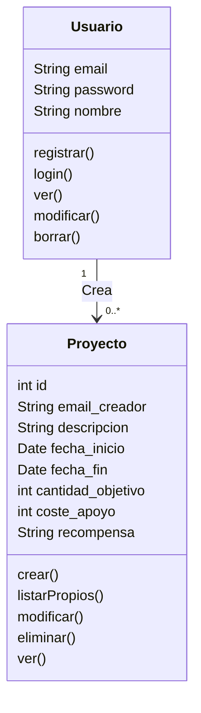
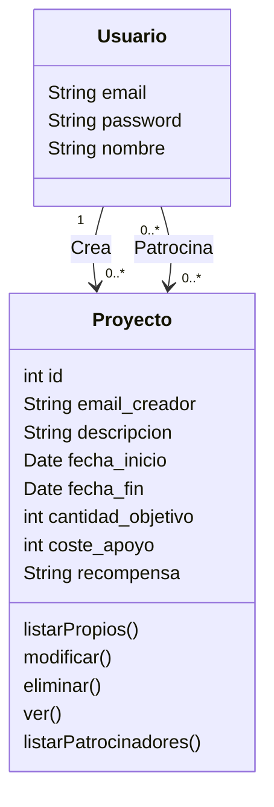
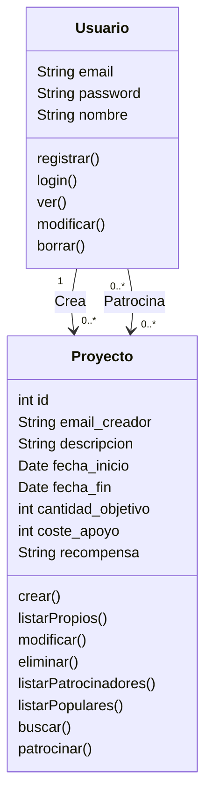
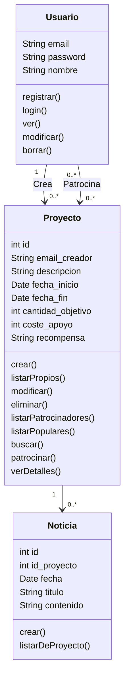

# Mapeado de las historias de usuario en el modelo

**Usuarios**

Historias 1.1, 1.2, 1.3: registro, edición, baja, modificación, inicio de sesión

**Proyectos**

Historias: 2.1, 2,2. crear proyectos, ver, modificar, eliminar proyectos creados por el usuario

- para poder ver, modificar o eliminar los proyectos del usuario necesitamos saber qué usuario ha creado el proyecto (relación “crea”)

- para poder listar los patrocinadores de un proyecto (2.2) necesitamos una relación “*patrocina*”, que sería de muchos a muchos

<aside>
💡 Si usamos una BD relacional para almacenar los datos, a nivel de la BD para modelar la relación “Patrocina”, que es de muchos a muchos, necesitaremos una tabla adicional, p.ej. “Patrocinios”, en la que cada fila tendría el id del usuario y el id del proyecto patrocinado. Pero recordemos que el modelo de datos del API REST no es lo mismo que el de una BD relacional, a este nivel como veremos podemos o no crear el recurso “Patrocinio”

</aside>

historias 2.3, 2.4, y 2.6

historia 2.5: ver detalles de un proyecto, incluyendo las noticias, para eso necesitamos (ya lo mostramos en el diagrama final para no ser pesados):

- una acción `verDetalles`en el proyecto.
- una relación de uno a muchos de proyectos a noticias
- una acción en Noticia para ver las noticias de un proyecto

**Noticias**

historia 2.7: acciones para crear, modificar y eliminar noticias

Finalmente el diagrama completo queda como sigue

