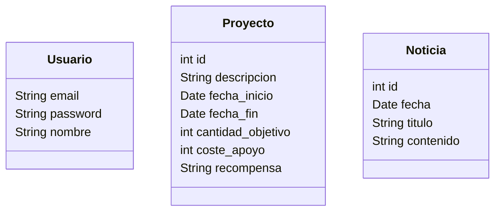

# Modelo del dominio inicial

Queremos desarrollar un sitio web dedicado a proyectos financiados con *crowdfunding.* En el sitio los usuarios autentificados podrán crear proyectos, y un usuario podrá enviar noticias sobre los proyectos que le pertenecen. Los usuarios deberían poder buscar y ver proyectos, y si se autentifican, apoyar económicamente un proyecto

<aside>
💡 En los sitios reales de este tipo, un proyecto suele tener varios niveles de recompensa, cada uno con un precio y una recompensa distintos cuando se finalice el proyecto. Para simplificar, de momento consideraremos que cada proyecto tiene un único nivel de recompensa y luego los añadiremos.

</aside>

### Definición inicial de los modelos

De momento sin relaciones, solo los atributos que se nos ocurren inicialmente, luego podrían cambiar

