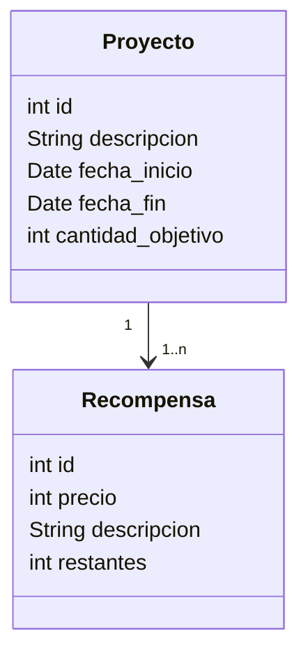
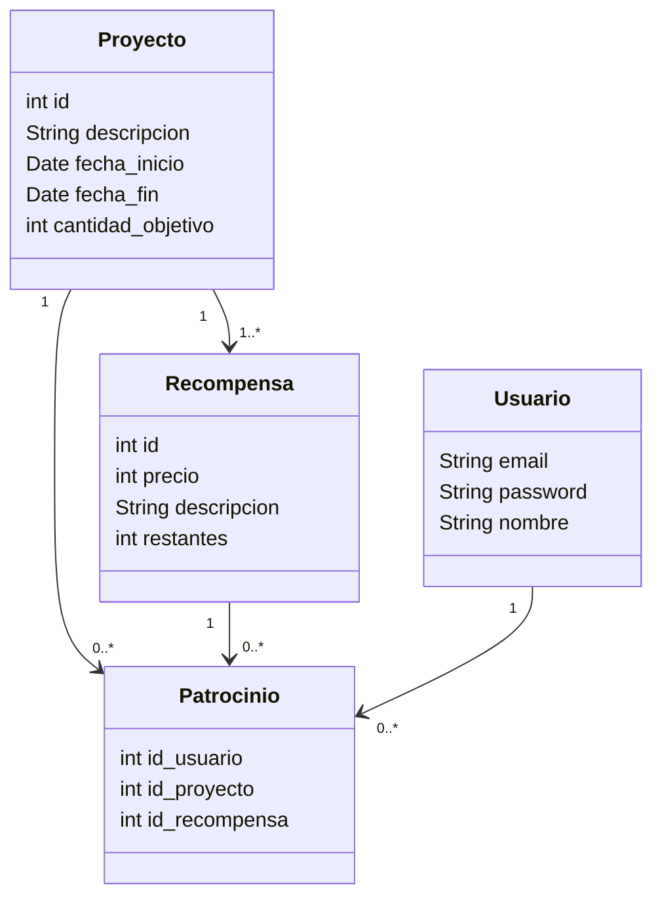

# Modificación del modelo: añadir niveles de recompensa

## Cambios en el modelo de dominio

En los sitios de ************crowdfunding************ cada proyecto suele tener diferentes niveles de patrocinio, cada uno con un precio distinto y una recompensa a obtener en caso de que se pague ese precio. Podemos añadir el nuevo recurso `Recompensa` y modificar el recurso `Proyecto`para reflejar la aparición del nuevo recurso:

Ahora ya no podemos representar la relación `Patrocina` de manera tan sencilla como antes, ya que ahora para patrocinar un proyecto tenemos que elegir una recompensa. Podemos crear un nuevo recurso, `Patrocinio`, que represente que un usuario apoya un proyecto con determinada recompensa 

